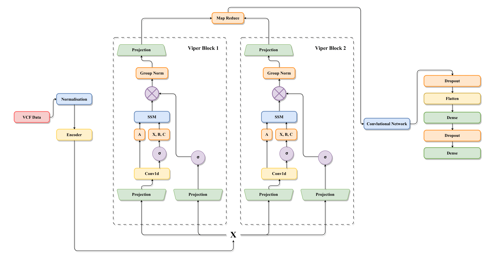
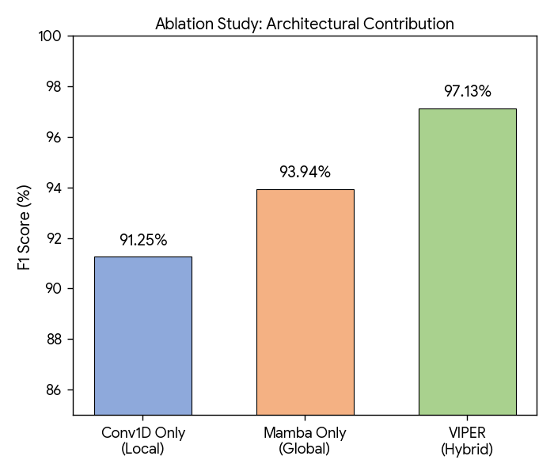
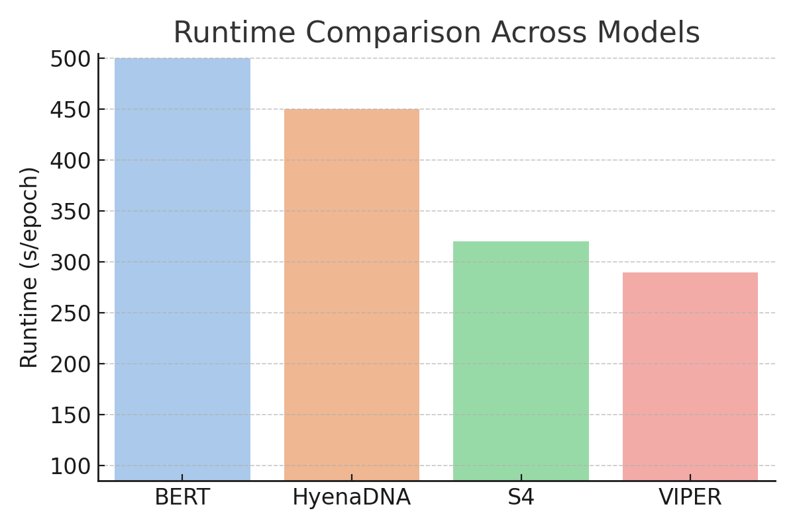
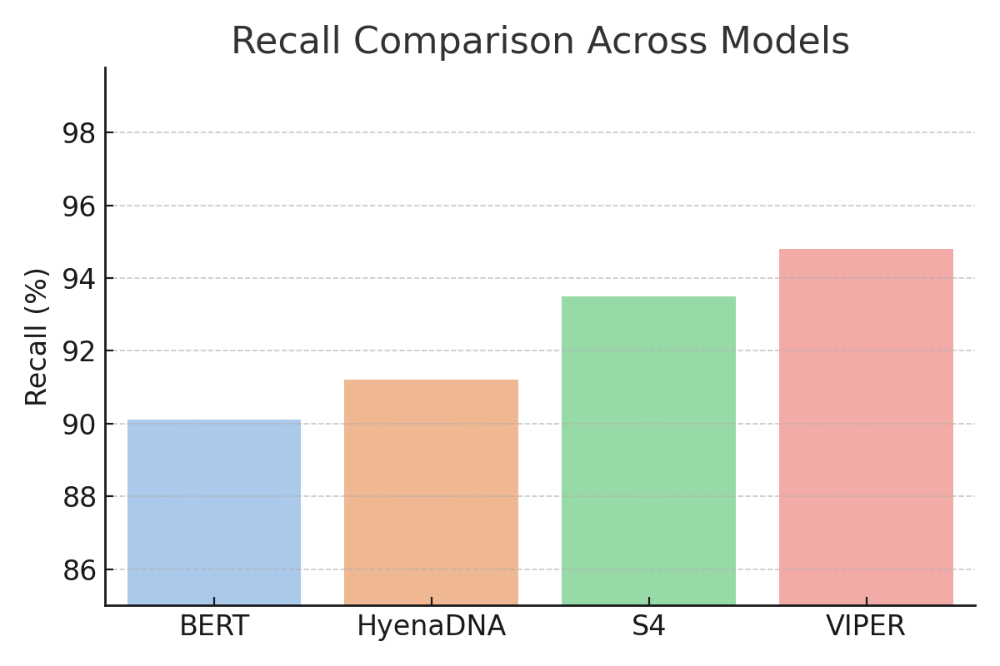
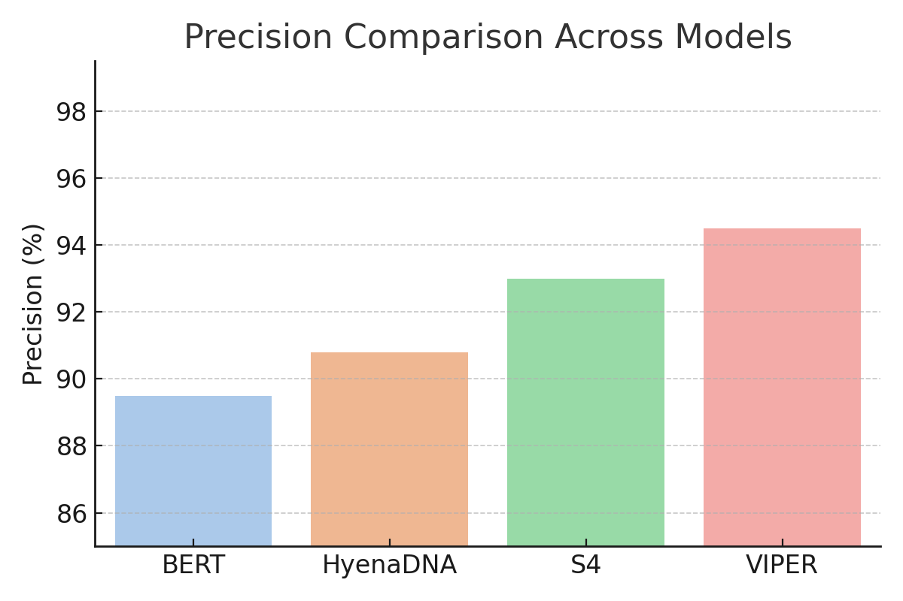
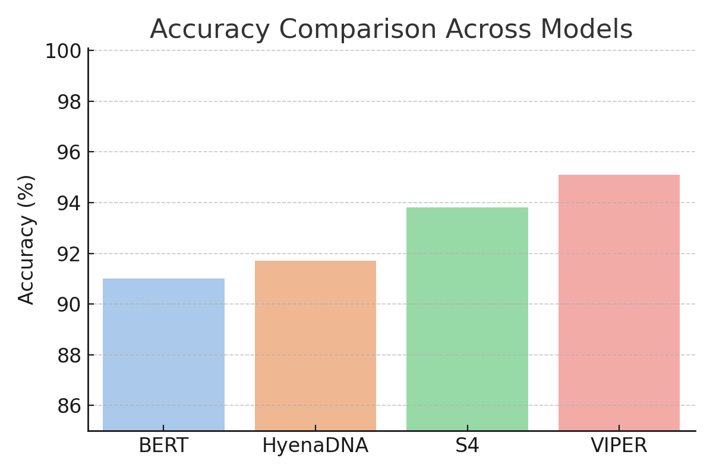
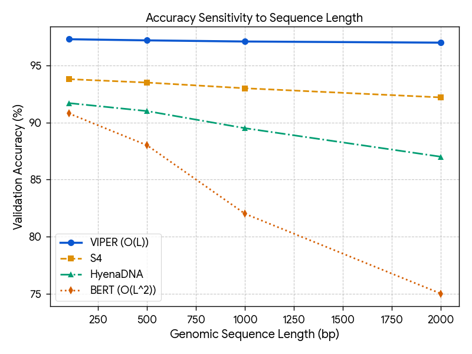
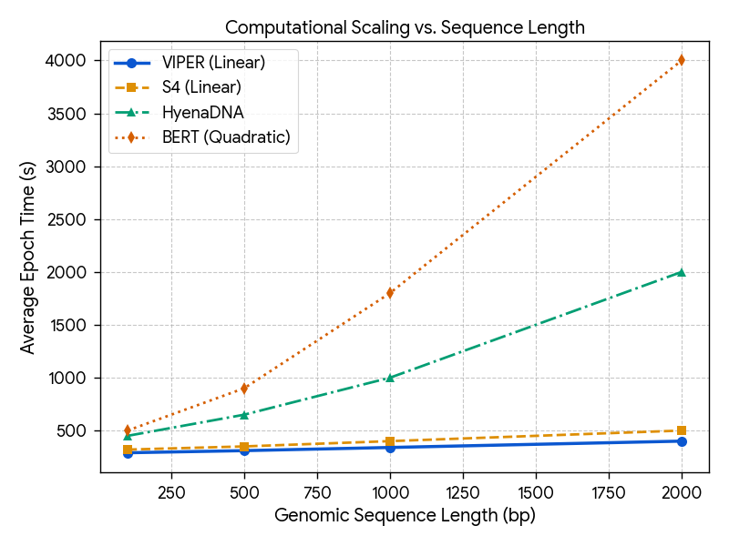
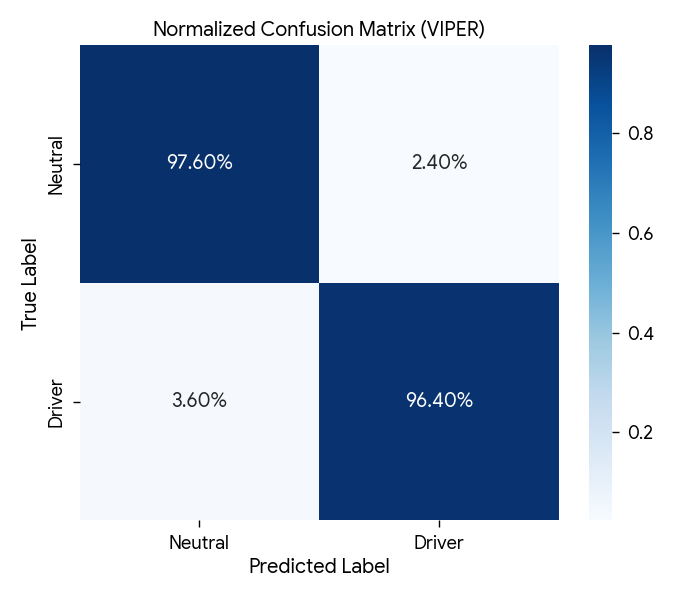

# VIPER: Variational Inference for Pattern Extraction and Recognition in Genomic Sequences

This repository contains the **official reference implementation** for the paper:

**Variational Inference for Pattern Extraction and Recognition in Genome Sequences using State Space Models for Cancer Detection**

VIPER is a hybrid deep learning framework for **cancer-causing mutation detection from genomic sequences**, combining **Conv1D layers** for local motif extraction with **Mamba-based State Space Models (SSMs)** for efficient long-range dependency modeling. The architecture is designed for scalability, interpretability, and clinical relevance in genome-wide mutation analysis.

---

## Repository Overview

This codebase supports the full experimental pipeline described in the paper, including:

- VCF-based genomic data preprocessing (COSMIC, GRCh37)
- Fixed-length genomic window extraction (101 bp)
- One-hot nucleotide encoding (101 × 4)
- VIPER hybrid architecture (Conv1D + Mamba blocks)
- Binary classification of driver vs non-driver mutations
- Training, evaluation, and ablation-ready components

The repository is intended for **reproducibility, inspection, and extension**, not redistribution of proprietary genomic datasets.

---

## Model Architecture

VIPER integrates local and global sequence modeling through a stacked hybrid design:

- **Conv1D layers** capture short-range nucleotide motifs (6–10 bp)
- **Group Normalization + ReLU** ensure stability across heterogeneous genomic samples
- **Mamba blocks (State Space Models)** model long-range genomic interactions with linear time complexity
- **Multiplicative gating** selectively amplifies biologically relevant signals
- **Dense classification head** performs binary mutation prediction

  

*Figure 1: Model architecture showcasing Variational Inference integrated with State Space Models for pattern extraction and recognition in genome sequences.*

---

## Dataset and Preprocessing

The model is evaluated on **coding point mutations from COSMIC**, aligned to the **GRCh37 reference genome** and stored in **VCF v4.1** format.

Preprocessing steps include:

- Filtering for high-confidence variants (`FILTER = PASS`)
- Extraction of a **101 bp genomic context window** centered on each mutation
- One-hot encoding into a binary nucleotide matrix
- Removal of low-frequency and low-variance mutations
- Stratified train / validation / test split (70 / 15 / 15)

Driver mutations are labeled using **Cancer Gene Census (CGC) Tier 1 annotations**.

---

## Training Configuration

All experiments follow a standardized configuration:

- Optimizer: Adam  
- Learning rate: 1e-4  
- Batch size: 64  
- Epochs: 30  
- Loss function: Binary Cross-Entropy  
- Hardware: NVIDIA A100 (80GB)

Random seeds are varied across runs to ensure statistical robustness.

---

## Performance Metrics

  

*Figure 2: Training and validation metrics including loss, accuracy, precision, recall, F1 score, AUC-ROC, and AUC-PR.*

---

## Ablation Study

To assess architectural contributions, we evaluate:

- Conv1D-only (local modeling)
- Mamba-only (global modeling)
- Full VIPER (hybrid)

  

*Figure 3: Ablation results showing the F1-score contribution of individual modules.*

---

## Comparison with State-of-the-Art Models

VIPER is compared against BERT, HyenaDNA, and S4 across accuracy, precision, recall, and runtime.

  

*Figure 4: Runtime per epoch comparison across models.*

  

*Figure 5: Recall comparison across models.*

  

*Figure 6: Precision comparison across models.*

  

*Figure 7: Accuracy comparison across models.*

---

## Scaling Behaviour

  

*Figure 8: Model accuracy across increasing genomic context windows, demonstrating VIPER’s stability for long sequences.*

  

*Figure 9: Computational scaling comparison showing linear-time behavior of VIPER.*

---

## Clinical Reliability

  

*Figure 10: Normalized confusion matrix indicating a low false-negative rate, critical for clinical screening.*

---

## Reproducibility Notes

- COSMIC data is not included due to licensing restrictions
- Example scripts use placeholder tensors by default
- Preprocessing utilities are fully implemented and dataset-agnostic
- All architectural components follow the paper specification

---

## Citation

If you use this code or build upon it, please cite the corresponding paper as described in the manuscript.

---

## License and Usage

This repository is intended for **academic research and reproducibility purposes only**.
